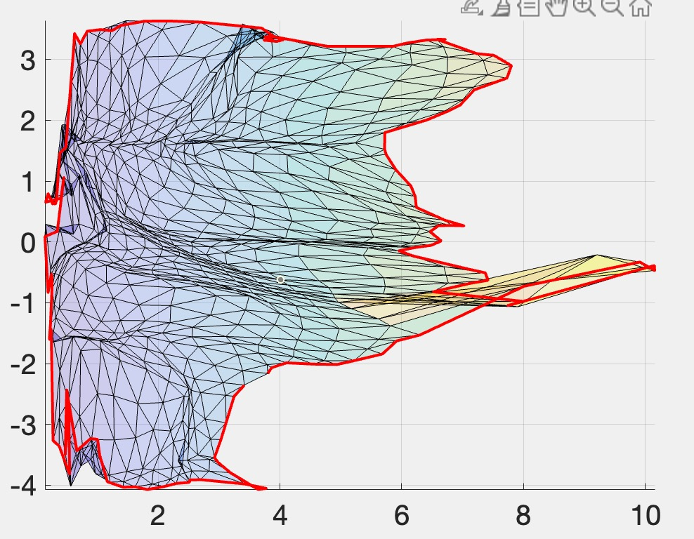

## **Topology-Preserving Smoothing of Retinotopic Maps**

This study aims to directly model the topological condition and generate topology-preserving and smooth retinotopic maps.

* [Data](https://osf.io/dbgkf/) is availale here.

---

## Structure of project:

```c
| - code/                 // includeing all code supporter the project running.
  | - Libraries/          // there are some third-part libiaries in this folder. 
  | - TPSR/               // this folder is core funtion of our project. 
| - data/                 // data for validation our solutions.
  | - mesh/
  |- ...
| - resources/            // there are some resources in here, like mesh atlas and so on.
| - Figures/              // store some figures from calculation.
| - result/								// store some results after calculation with our approach.
```

**NOTE: **

* .m files under the root category could run directly and they will show the figure results.

* Data are required when running *figure.m files.


##  Starting and adding our code to your project.

---

### configuration our code to

* Adding the **TPSR** folder in your project.
* Selecting this folder to the MATLAB path.

### start your work

1. data preparation:

* Download our data in above link.
* Add the third part libraries to support some functions, like `read_mfile`.
* read data file as face, vertices and extra values, there are some samples from our project: 

```matlab
fn = subjects(subi).name;
[Fm,Vm, Em]=read_mfile(['../data/mesh_data/' fn]);

% Load the full hemisphere
[Ffull,Vfull, Efull]=read_mfile(['../data/mesh_data/' fn(1:end-2) '_ecc.m']);

% convert to uvm coordinate with disk_conformal_map()
uvm = disk_conformal_map(Fm,Vm);

% load cut info

roipatch = load('../data/v1');
id2delete = roipatch.id2delete;

[Froi, V_roi, vfather] = gf_remove_mesh_vertices(Fm, Vm, id2delete);

```

After loading data, you could do some handler continually.

2. Smoothing processing:

Using our function`topological_smoothing`to smooth:

```matlab

changetol = 0.1; 
smooth_lambda0 = 0.001; % initial of smooth
smooth_avg_k = 2;  % size of smooth along the boundary
meanddth = 1; % average ddth 

visxy_s = topological_smoothing(Froi,uv_p,  visxy_corrected, R2,...
                                anchor, anchorpos,changetol, ...
                            smooth_lambda0,smooth_avg_k, meanddth);

```


## Comparison between approaches of smoothing

results of smoothing V1V2V3

---

* before smoothing


* Average smoothing



* Median smoothing

  

* Laplacian smoothing 


* smoothing with our proposal


